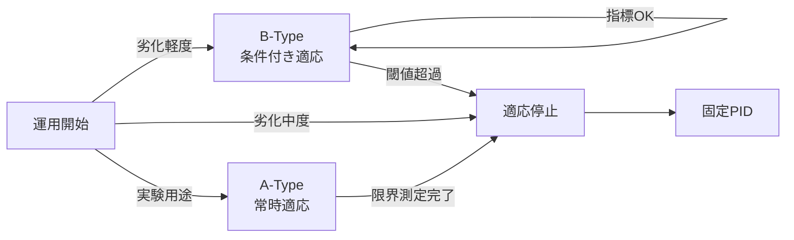

# 【制御】🧪 19. 適応制御の適用限界整理  
### ― A-Type / B-Type 検証結果まとめ【数値・判断基準】

topics: ["制御", "適応制御", "PID", "FSM"]

---

## 🎯 本記事の目的

本記事は、シリーズ（01〜16）の検証結果から  
**適応制御を「使ってよい範囲／使ってはいけない範囲」**を  
**数値指標と判断基準**で整理する。

- 思想説明：❌  
- 期待論：❌  

👉 **運用可否を即決できる資料**を目的とする。

---

## 🧱 検証前提（共通）

- 対象：V–I 制御系（PID 基本）
- 劣化：摩擦／抵抗増加（最大 1000 days 相当）
- 外乱：ステップ外乱＋ノイズ
- 比較：
  - 固定 PID
  - A-Type（常時適応）
  - B-Type（FSM 許可制）

---

## 🗺️ 適用可否の全体像（判断フロー）



---

## 🧪 A-Type 検証結果（事実）

### ✅ 確認できたこと
- 劣化初期での**一時的追従改善**
- ゲイン再調整の成立
- 短期応答の改善

### ❌ 保証できなかったこと
- **Δt（時間信頼性）**
- 長期安定性
- 再現性

---

## 📊 数値傾向（共通観測）

| 指標 | 劣化進行時の傾向 | 備考 |
|---|---|---|
| Δt | 単調増加 | 全方式共通 |
| Kp | 増加 → 飽和 | 過補償リスク |
| 振幅 A | 低下 | 可制御性低下 |

👉 **A-Type は短期改善、長期保証なし**

---

## 🛡️ B-Type 検証結果（事実）

### ✅ 可能になったこと
- 適応の**停止**
- 固定 PID への**即時フォールバック**
- 信頼性の**下限維持**

### 🔐 停止条件（例）
- Δt / Δt₀ > 閾値  
- Kp / Kp₀ > 閾値  
- A / A₀ < 閾値  

```text
if 指標が閾値超過:
    ADAPT_STOP
    FALLBACK_TO_PID
```

---

## 🧭 適用可否マトリクス（確定）

| 劣化レベル | 推奨方式 | 理由 |
|---|---|---|
| 軽度 | B-Type | 条件付き適応可 |
| 中度 | B-Type → 停止 | 指標悪化検知 |
| 重度 | 固定PID | 適応は逆効果 |
| 実験 | A-Type | 限界測定用 |

---

## 🚫 NG運用（即不合格）

- ❌ A-Type を実運用で使用
- ❌ 適応を常時 ON
- ❌ 停止条件を数値化しない
- ❌ 固定 PID への復帰手段なし

---

## ✅ 結論（事実整理）

- 適応制御は主制御にはならない  
- 常時使用を前提とした設計は不適合  
- 停止条件を含む設計が前提となる  
- 運用構成は **B-Type + 固定 PID フォールバック** とする  

---

## 📌 最終整理

- 実験用途：🧪 A-Type  
- 運用用途：🛡️ B-Type  
- 最終防衛線：⚙️ 固定 PID  

本整理をもって、  
**適応制御の運用区分および判断基準は確定とする。**
