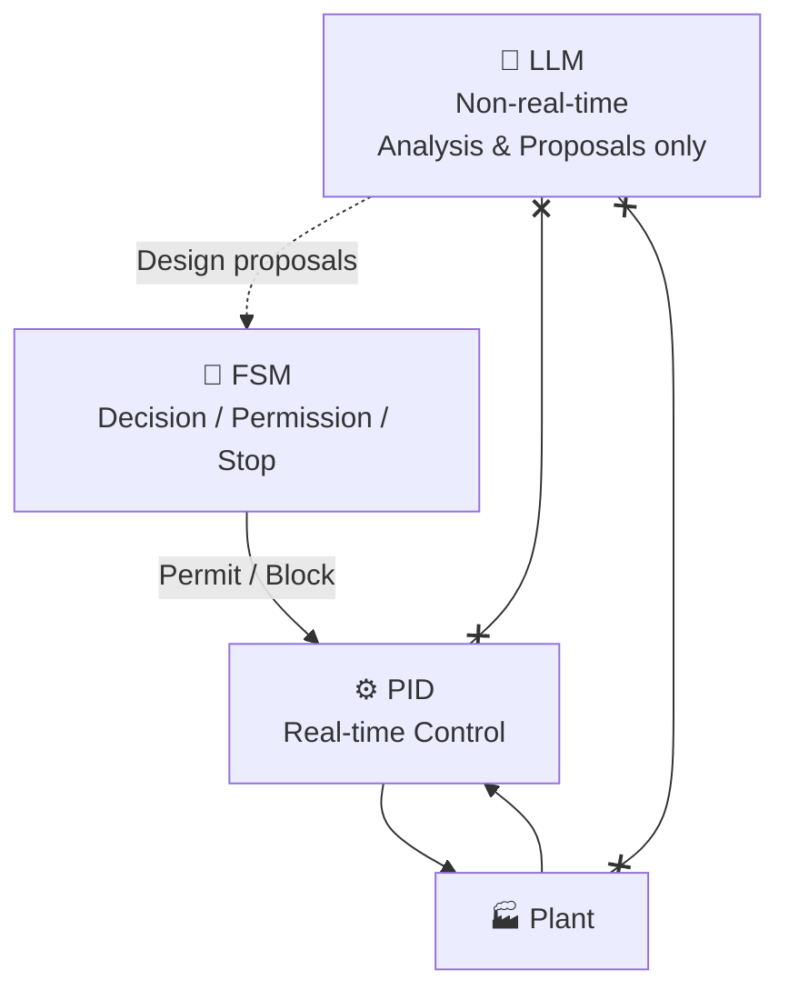

# 【Control】🧩 17. AITL Control Architecture — Final Specification  
### ― Clear Responsibility Separation for PID, FSM, Adaptation, and LLM

topics: ["control", "PID", "FSM", "adaptive control", "architecture"]

---

## 🎯 Purpose of This Article

This article summarizes **only the finalized design specification**  
of the AITL control architecture, derived from Articles 01–16.

- Philosophy / background: ❌ Not included  
- Value judgments: ❌ Not included  

👉 The goal is to **immediately verify**:
- What each layer is responsible for  
- What must never be done  
- Where the system breaks if violated  

---

## 🧱 Overall Architecture (Final)

### 🔁 Layered Structure

---

## ⚙️ Layer Responsibilities (Final Table)

### 📌 Responsibility Matrix

| Layer | Primary Role | Real-Time | Allowed | Forbidden |
|---|---|---|---|---|
| ⚙️ PID | Control | ✅ | Stabilization, tracking, V–I response | Decisions, learning, optimization |
| 🧾 FSM | Judgment | ✅ | State transitions, permit/block | Control input generation, inference |
| 🔁 Adaptation | Assistance | ✅ | Limited gain tuning (conditional) | Always-on, unlimited compensation |
| 🧠 LLM | Analysis | ❌ | Root-cause analysis, design proposals | Real-time control, safety decisions |

---

## ⚙️ PID Layer Specification

### ✅ What PID Does
- Real-time stabilization  
- V–I response within design assumptions  
- Deterministic behavior  

### ❌ What PID Must Never Do
- State judgment  
- Mode switching  
- Gain redesign  
- Learning or optimization  

👉 **PID must “stabilize silently.”**

---

## 🧾 FSM Layer Specification

### ✅ What FSM Does
- Control mode definition  
- State transition management  
- **Permit / block adaptation**  
- Forced stop and fallback  

### ❌ What FSM Must Never Do
- Control signal computation  
- Gain calculation  
- Learning or optimization  

👉 **FSM is for judgment only.**

---

## 🔁 Adaptive Control (A-Type / B-Type)

### 📊 Positioning Comparison

| Item | A-Type | B-Type |
|---|---|---|
| Purpose | Limit exploration | Operation |
| Adaptation | Always ON | FSM-permitted only |
| Reliability | ❌ Not guaranteed | ✅ Lower bound maintained |
| Usage | Experiments only | Real operation |

---

## 🧠 LLM Layer Specification

### ✅ What LLM Does
- Analyze abnormal logs  
- Explain degradation causes  
- Propose design improvements  

### ❌ What LLM Must Never Do
- Real-time control  
- Stop / recovery decisions  
- Safety judgment  

👉 **LLM only “thinks.” It never acts.**

---

## 🚫 Forbidden Design Patterns (Critical)

Any of the following is considered **design failure**:

- ❌ Inserting LLM into the control loop  
- ❌ FSM performing optimization or learning  
- ❌ Always-on adaptive control  
- ❌ Undefined numeric stop thresholds  

---

## ✅ Applicable Domains

- Industrial control systems  
- Robotics  
- AI-assisted control architectures  

---

## 📌 Final Summary

- Control: ⚙️ PID  
- Judgment: 🧾 FSM  
- Adaptation: 🔁 Conditional  
- Analysis: 🧠 LLM (non-real-time)  

👉 **This responsibility separation must not be violated.**

---

## 🔜 Next Article

**18. AI Control Safety Checklist**  
— Safety Envelope, Stop Logic, and Recovery Design (with diagrams and tables)
