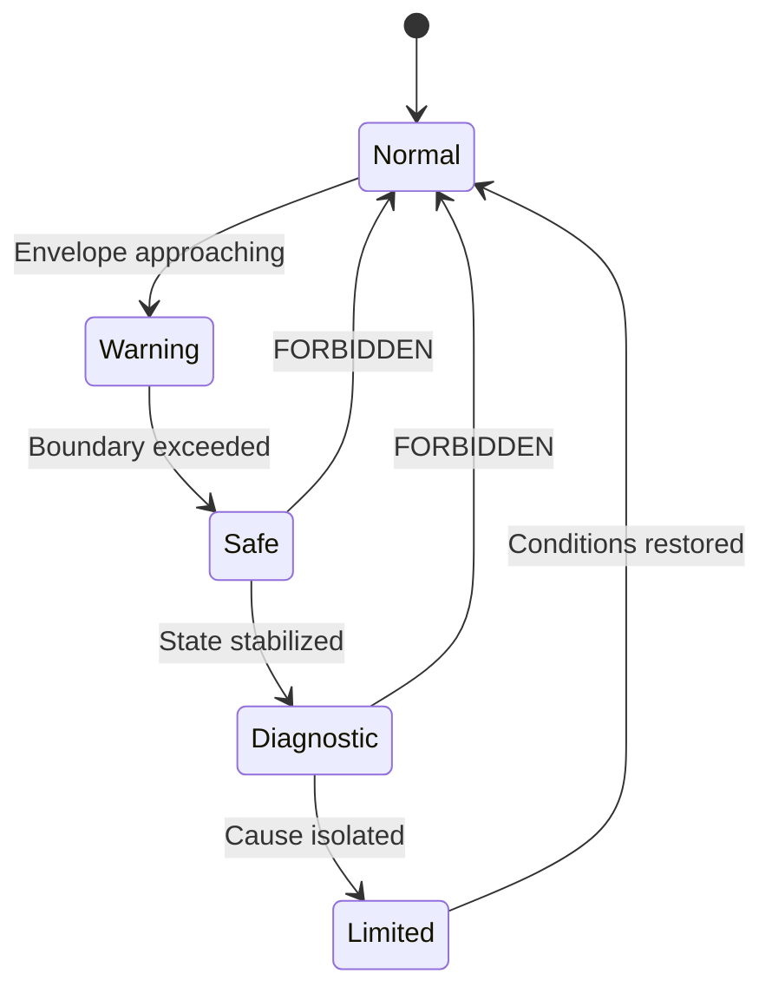

# 【Control】🛡️ 18. AI Control Safety Design Checklist  
### ― Safety Envelope, Stop Logic, and Recovery (Pre-Implementation Review)

topics: ["control", "AI", "safety design", "FSM"]

---

## 🎯 Purpose of This Article

This article provides a **mandatory safety design checklist**  
to be reviewed **before deploying AI-assisted control systems into real operation**.

- Philosophy / background: ❌  
- Inspirational discussion: ❌  

👉 The goal is **direct use in design reviews, safety audits, and approval processes**.

---

## 🧱 Mandatory Safety Architecture (3 Required Elements)

Safe AI control requires **all three** of the following:

1. 🟦 **Safety Envelope (never exceed)**  
2. 🟥 **Stop Logic (force stop)**  
3. 🟩 **Recovery Control (safe return)**  

Missing any one of these → **deployment not allowed**.

---

## 🗺️ Safety Design Flow (Overall State Diagram)



---

## 🟦 1. Safety Envelope (Mandatory)

### ✅ Definition Checklist

| Item | Defined | Notes |
|---|---|---|
| Monitored state variables | ⬜ | Position / velocity / voltage / current |
| Upper & lower bounds | ⬜ | Hard limits |
| Rate-of-change limits | ⬜ | d/dt constraints |
| Time-in-state limits | ⬜ | Timeout rules |

---

### 📐 Design Rules (Mandatory)

- ✅ Defined by humans  
- ✅ Fixed constants  
- ❌ Updated by AI or learning  

👉 **The Safety Envelope must never be a learning target.**

---

## 🟥 2. Stop Logic (Mandatory)

### 🔍 Typical Decision Metrics

| Metric | Meaning |
|---|---|
| Δt / Δt₀ | Response time ratio |
| Kp / Kp₀ | Gain compensation ratio |
| A / A₀ | Amplitude ratio |

---

### ⚙️ Decision Logic Example

```text
if metric > threshold:
    ADAPT_STOP
```

### ✅ Requirements
- Deterministic  
- Numerically explainable  
- Fully logged and traceable  

---

## 🧯 3. Recovery Control (Mandatory)

### 🧩 Required Modes

| Mode | Role |
|---|---|
| Safe | Minimum output, guaranteed behavior |
| Diagnostic | Root-cause isolation |
| Limited | Constrained recovery |
| Normal | Standard operation |

---

### 🚫 Forbidden Transitions (Critical)

- ❌ Safe → Normal  
- ❌ Diagnostic → Normal  
- ❌ AI-based recovery decisions  

👉 **Recovery must always be gradual.**

---

## 🧠 LLM Usage Constraints (Safety Requirement)

### ✅ Allowed
- Root-cause analysis  
- Log summarization  
- Design improvement proposals  

### ❌ Forbidden
- Safety judgment  
- Stop decisions  
- Recovery decisions  

---

## 🚫 Immediate Disqualification (NG Designs)

- ❌ Learning the Safety Envelope  
- ❌ Treating stop as a warning only  
- ❌ Automatic immediate recovery  
- ❌ No logging of boundary violations  

---

## ✅ Final Acceptance Criteria

All three must be **YES**:

- ☑ Cannot exceed limits (Envelope)  
- ☑ Can forcibly stop (Stop Logic)  
- ☑ Can safely return (Recovery Control)  

---

## 📌 Final Specification Summary

- Safety boundary: 🟦 Safety Envelope  
- Stop decision: 🟥 FSM (deterministic)  
- Recovery design: 🟩 Gradual return  

👉 **Any AI control system missing these is not deployable.**

---

## 🔜 Next Article

**19. Applicability Limits of Adaptive Control**  
— Quantitative results for A-Type and B-Type (tables and diagrams)
