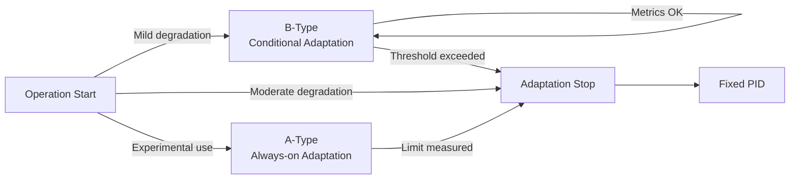

# 【Control】🧪 19. Applicability Limits of Adaptive Control  
### ― Quantitative Results and Decision Criteria for A-Type / B-Type

topics: ["control", "adaptive control", "PID", "FSM"]

---

## 🎯 Purpose of This Article

This article summarizes verification results from Articles 01–16  
to define **where adaptive control may be used and where it must not be used**,  
based strictly on **numerical indicators and decision criteria**.

- Philosophy or ideology: ❌  
- Optimistic expectations: ❌  

👉 The goal is **immediate operational decision-making**.

---

## 🧱 Common Verification Conditions

- Target system: V–I control loop (PID-based)
- Degradation model: friction / resistance increase (up to 1000 days equivalent)
- Disturbances: step disturbance + noise
- Compared controllers:
  - Fixed PID
  - A-Type (always-on adaptation)
  - B-Type (FSM-permitted adaptation)

---

## 🗺️ Applicability Decision Flow



---

## 🧪 A-Type Results (Observed Facts)

### ✅ What Was Confirmed
- Temporary tracking improvement in early degradation
- Gain retuning feasibility
- Short-term response improvement

### ❌ What Could Not Be Guaranteed
- **Δt (time reliability)**
- Long-term stability
- Reproducibility

---

## 📊 Common Quantitative Trends

| Metric | Trend with Degradation | Notes |
|---|---|---|
| Δt | Monotonic increase | All controllers |
| Kp | Increase → saturation | Over-compensation risk |
| Amplitude A | Decrease | Loss of controllability |

👉 **A-Type improves short-term response but provides no long-term guarantees.**

---

## 🛡️ B-Type Results (Observed Facts)

### ✅ What Became Possible
- **Stopping adaptation**
- Immediate fallback to fixed PID
- Maintaining a **reliability lower bound**

### 🔐 Stop Conditions (Examples)
- Δt / Δt₀ > threshold  
- Kp / Kp₀ > threshold  
- A / A₀ < threshold  

```text
if metric exceeds threshold:
    ADAPT_STOP
    FALLBACK_TO_PID
```

---

## 🧭 Applicability Matrix (Final)

| Degradation Level | Recommended Method | Reason |
|---|---|---|
| Mild | B-Type | Conditional adaptation acceptable |
| Moderate | B-Type → Stop | Metric degradation detected |
| Severe | Fixed PID | Adaptation becomes harmful |
| Experimental | A-Type | Limit exploration only |

---

## 🚫 Disallowed Operations (Immediate Failure)

- ❌ Using A-Type in real operation
- ❌ Always-on adaptive control
- ❌ No numerical stop criteria
- ❌ No fallback to fixed PID

---

## ✅ Conclusion (Fact-Based)

- Adaptive control does not function as the primary controller  
- Designs assuming continuous adaptation are not suitable for operation  
- Stop logic is a mandatory design requirement  
- Operational configurations are based on **B-Type with fixed PID fallback**

---

## 📌 Final Summary

- Experimental use: 🧪 A-Type  
- Operational use: 🛡️ B-Type  
- Final defense line: ⚙️ Fixed PID  

With this summary,  
**the applicability boundaries and operational criteria for adaptive control are considered finalized.**

