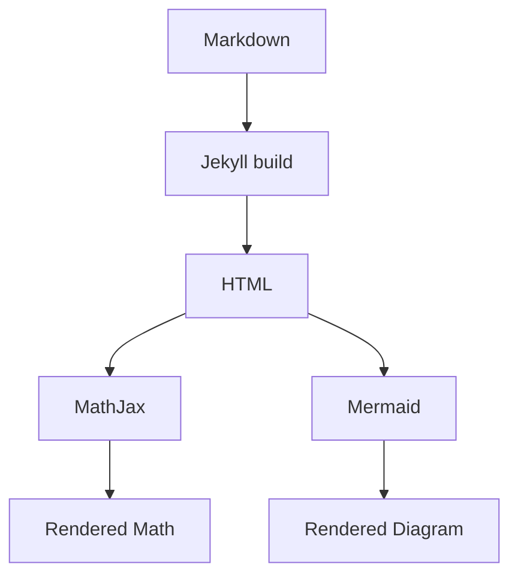
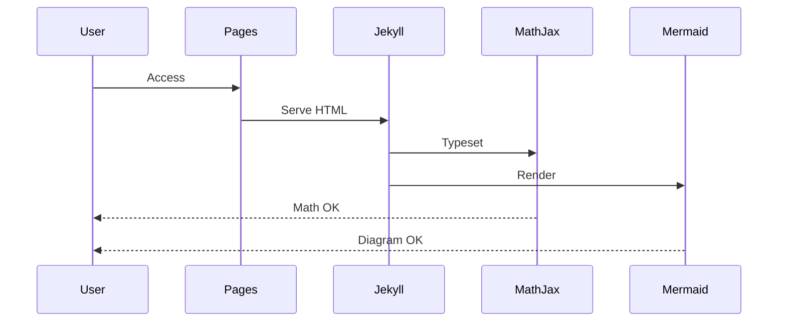

[MathJax & Mermaid 表示テストページ](https://samizo-aitl.github.io/zenn-articles/pages/math-mermaid-test/)

# MathJax & Mermaid 表示テスト

## 数式（MathJax）

インライン数式：\( a^2 + b^2 = c^2 \)

$$
I \propto \frac{W}{L}
$$

$$
W_\mathrm{eff} \simeq 2H_\mathrm{fin} + W_\mathrm{fin}
$$

---

## Mermaid（flowchart）

---

## Mermaid（sequenceDiagram）

